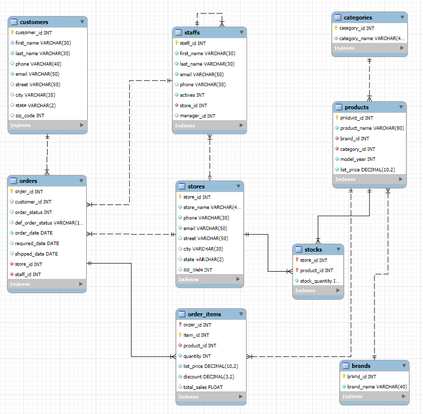
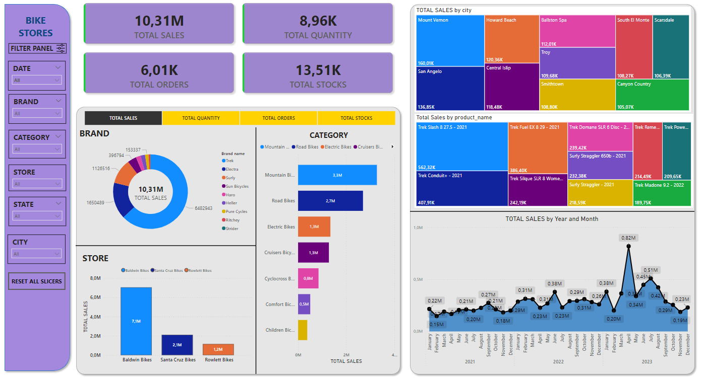

<!-- omit in toc -->
# Bike Stores MySQL + Power BI Project

<!-- omit in toc -->
## Content
- [Project Overview](#project-overview)
- [Database Schema](#database-schema)
- [Analyses using MySQL](#analyses-using-mysql)
- [Data Visualization using Power Bi Desktop](#data-visualization-using-power-bi-desktop)

## Project Overview

Data analysis was performed using MySQL and data visualized by Power BI Desktop. This project reflects three bike stores based in the United States. The database contains 9 tables. Each table includes various information about customers, orders, staff, stores, brands, categories, products and stocks from 2021 to 2023.

## Database Schema

The following illustrates the database diagram:

The database Bike Stores has 9 tables:  
1) Customers table  
The customers table contains customer information including `customer_id` (unique identifier for each customer), `first_name`, `last_name`, `phone`, `email`, `street`, `city`, `state` and `zip_code`. The table has 1445 customers.  
1) Stores table  
The stores table includes the store’s information. Each store has a unique `store_id` (unique identifier for each customer), `store_name`, contact information such as `phone` and `email`, and an address including  `street`, `city`, `state` and `zip_code`.  
The table has 3 stores: Santa Cruz Bikes is located in the state of California, Baldwin Bikes is located in the state of New York City, Rowlett Bikes is located in the state of Texas.   
1) Staffs table  
The staffs table stores the essential information of staffs including `staff_id` (unique identifier for each customer), `first_name`, `last_name`. It also contains the communication information such as `phone` and `email`. A staff works at a store specified by the value in the `store_id` column. A store can have one or more staffs. A staff reports to a store manager specified by the value in the `manager_id` column. If the value in the `manager_id` is null, then the staff is the top manager. The table has 3 sellers in each store and 1 top manager.  
1) Orders table   
The orders table stores information including `order_id` (unique identifier for each order) `customer_id`, `order_status`, `order_date`, `required_date`, `shipped_date`. Order status consists of states: 1 – Pending, 2 – Processing, 3 – Rejected, 4 – Completed. It also stores the information on where the sales transaction was created (`store_id`) and who created it (`staff_id`).  
1) Order_items table  
The order_items table stores the line items of a sales order. Each line item belongs to a sales order specified by the `order_id` column. A sales `item_id` includes `product_id`, `quantity`, `list_price`, and `discount`.  
1) Categories table  
The categories table has 9 categories: children’s bicycles, comfort bicycles, cruises bicycles, cyclocross bicycles, electric bikes, mountain bikes and road bikes. Each category has a unique ID in `category_id` column.  
1) Brands table  
The brands table stores information of 9 bikes brands: Electra, Haro, Heller, Pure Cycles, Ritchey, Strider, Sun Bicycles, Surly, Trek. Each brand has a unique ID in `brand_id`d column.  
1) Products table  
The products table stores the product’s information such as `product_name`, `brand_id`, `category_id`, `model_year`, and `list_price`. Each product has a unique ID.  Each product belongs to a brand specified by the `brand_id` column. A brand may have zero or many products. Each product also belongs to a category specified by the `category_id` column. Also, each category may have zero or many products. In total, sold 321 products were sold.
1) Stocks table  
The stocks table stores the inventory information, i.e., the `quantity`of a particular `product_id`in a specific `store_id`.

## Analyses using MySQL

Total sales were calculated and added to the table order_items, and also added a column to understand the order status.  
__Data analysis in MySQL take place in several stages:__  
1. Analyzing sales by products:
- selecting top 10 best-selling products;
- selecting most rejected products and calculate percentage of rejections.
2. Analyzing sales by brands:
- calculating revenue by brand and year, as well as percentage of sales;
- calculating best-selling brand in each city.
3. Analyzing sales by categories:
- calculating revenue by category and year, as well as percentage of sales;
- calculating best-selling category in each city.
4. Analyzing sales by stores:
- computing total sales by each store;
- calculating average delivery time;
- calculating best month for each store based on total sales.
5. Analyzing sale by customers:
- defining top 10 customers by purchase;
- defining best customers in each city based on total sales;
- identifying customers whose goods weren’t shipped or has been delayed.
6. Analyzing sales by city:
- calculating total sales by city.
7. Analyzing stocks:
- calculating in which store and which product has no stocks in the warehouse.
8. Analyzing employees:
- identifying best employees in each store.
9. Sales trend analysis:
- calculating sales by month and sales growth rate.
10. Creating a store procedure (called update_sales)  
As soon as the product is sold the record add to the table orders and order_items, as well as the same quantity reduced from stock quantity in the table stocks.

## Data Visualization using Power Bi Desktop

Retrieving data from MySQL database and performing data visualization with Power Bi Desktop. Dashboard contains of different slicers such as date, brand, category, store, state and city. You may also choose to consider total sales, total quantity, total orders and total stocks. Dashboard includes donut chart about brand, horizontal bar chart about category, bar chart about store, treemap cgart about best 10 products and best 10 cities, and line chart from 2021 to 2023. Bike Stores database Dashboard for quick view:

